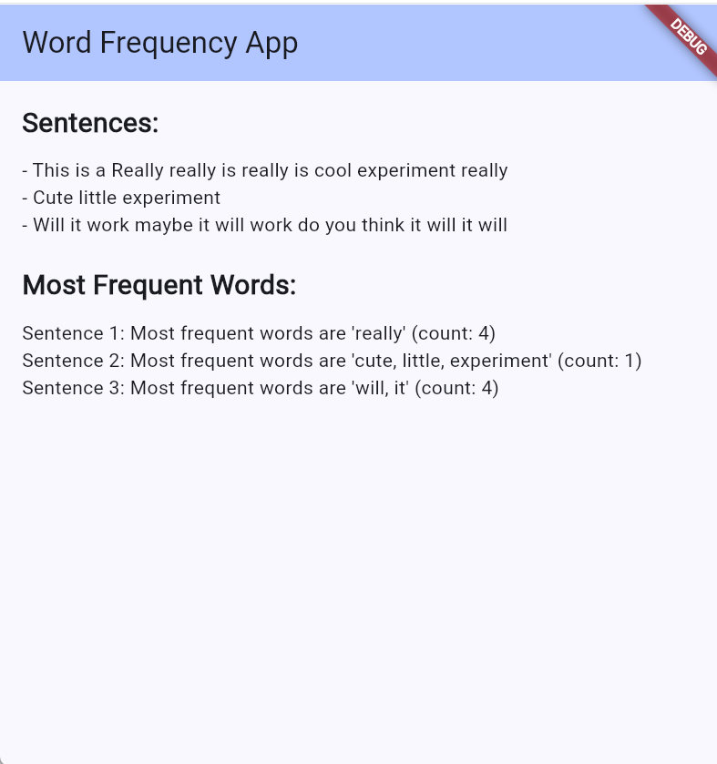

# 📱 Assignment #1 - Word Frequency Counter - Group No. 4

## 👥 Group Members
- **Hamad Naseem** - 2280143  
- **Muhammad Bin Tariq** - 2280150

## 📱 About
This is a simple Dart console application that analyzes a list of sentences and finds the words with the highest frequency in each sentence.

## 🚀 Features
- Takes multiple sentences.
- Converts all sentences to lowercase for uniform counting.
- Splits sentences into words.
- Counts the frequency of each word.
- Displays the most frequent words along with their count for each sentence.

## 🛠 How to Run
1. Clone this repository.
2. Make sure Dart SDK or Flutter is installed.
3. Open the project folder.
4. Run:
   ```bash
   flutter run

## 📄 Example Output


A few resources to get you started if this is your first Flutter project:

- [Lab: Write your first Flutter app](https://docs.flutter.dev/get-started/codelab)
- [Cookbook: Useful Flutter samples](https://docs.flutter.dev/cookbook)

For help getting started with Flutter development, view the
[online documentation](https://docs.flutter.dev/), which offers tutorials,
samples, guidance on mobile development, and a full API reference.
